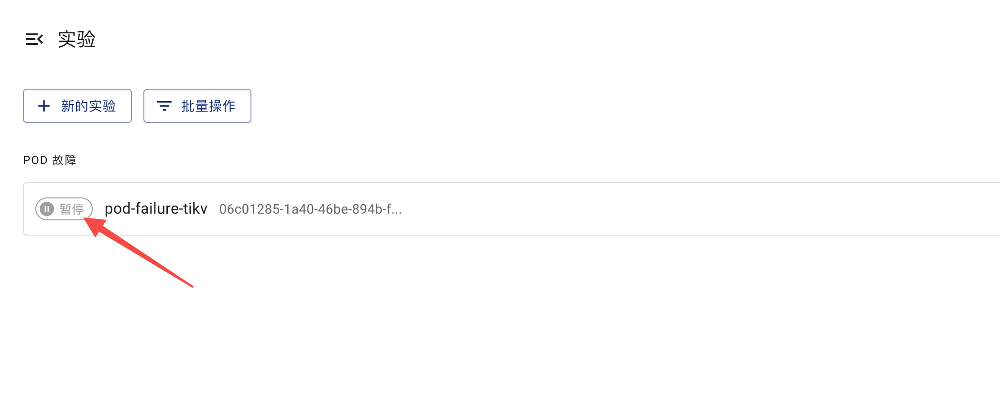
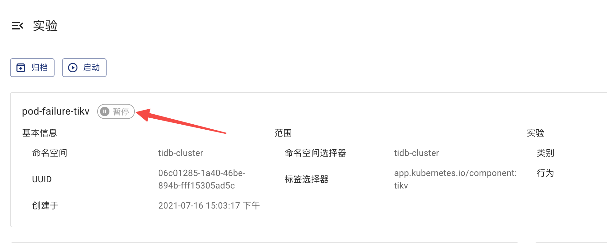

本文档介绍如何去检查混沌实验的运行结果。

## 实验阶段定义

在 Chaos Mesh，根据混沌实验的执行流程，可以将整个混沌实验生命周期分成四个阶段：

- 注入中：说明混沌实验在支持注入故障的操作中，理论上这个阶段持续的时间会很短，如果存在实验持续处在此阶段，可能混沌实验出现了异常，可以查看事件信息确定异常原因。
- 运行中：当所有目标的故障都注入成功后，混沌实验进入运行阶段。
- 暂停中：当用执行[暂停](run-a-chaos-experiment.md/#暂停混沌实验)行为，Chaos Mesh 会恢复所有测试目标，此实验进入暂停阶段。
- 实验结束：此阶段只有当用户设置了持续时间配置情况下，实验运行时间达到了持续时间后，Chaos Mesh 会恢复所有测试目标，表示实验已经结束。

## 通过 Chaos Dashboard 检查实验结果

1. 你可以在混沌实验列表页面查看到具体实验的运行阶段，如下图：
   

2. 你可以在混沌实验详情页面查看实验的运行阶段，如下图：
   

:::note 注意
如果实验长时间处在**注入中**阶段，可能混沌实验出现了异常，如配置的 Selectors 未选出待测目标，这时候可以通过查看**事件信息**确定异常原因，以及检查混沌实验的配置信息等。
:::

## 通过 `kubectl` 检查实验结果

可以使用 `kubectl describe` 命令查看此混沌实验对象的 `status` 和 `event`:

```shell
kubectl describe podchaos pod-failure-tikv -n tidb-cluster
```

成功执行上述命令后，预期输出如下：

```shell
...
Status:
  Conditions:
    Reason:
    Status:  False
    Type:    Paused
    Reason:
    Status:  True
    Type:    Selected
    Reason:
    Status:  True
    Type:    AllInjected
    Reason:
    Status:  False
    Type:    AllRecovered
  Experiment:
    Container Records:
      Id:            tidb-cluster/basic-tikv-0
      Phase:         Injected
      Selector Key:  .
    Desired Phase:   Run
Events:
  Type    Reason           Age   From          Message
  ----    ------           ----  ----          -------
  Normal  FinalizerInited  39s   finalizer     Finalizer has been inited
  Normal  Paused           39s   desiredphase  Experiment has been paused
  Normal  Updated          39s   finalizer     Successfully update finalizer of resource
  Normal  Updated          39s   records       Successfully update records of resource
  Normal  Updated          39s   desiredphase  Successfully update desiredPhase of resource
  Normal  Started          17s   desiredphase  Experiment has started
  Normal  Updated          17s   desiredphase  Successfully update desiredPhase of resource
  Normal  Applied          17s   records       Successfully apply chaos for tidb-cluster/basic-tikv-0
  Normal  Updated          17s   records       Successfully update records of resource
```

上述输出中，主要包含两部分：

1. 状态定义

   状态定义表现形式为一组混沌实验状态记录，记录包含四类，分别为：

   - `Paused`： 代表混沌实验处在暂停中
   - `Selected`：代表正确选择出待测试目标
   - `AllInjected`：代表所有的待测试目标都已经被成功注入故障
   - `AllRecoverd`：代表所有的待测试目标的故障都被成功恢复

   可以通过这四类状态记录推断出当前混沌实验的真实运行情况。例如当 `Paused`, `Selected`, `AllRecoverd` 的状态是 `True`, `AllInjected` 的状态是 `False`, 代表当前实验证处在暂停中。

   :::note 注意
   为了简化 Chaos Dashboard 中混沌实验阶段的定义，根据上述四类混沌状态记录推导出四个基础阶段定义。即[实验的阶段定义](#实验阶段定义)。你可以从上述的四类实验记录组合中可以推导出更多的信息，例如当 `Paused` 为 `True` 的时候，我们就可以认为混沌实验处在暂停状态，但是如果此时的 `Selected` 值为 `False`，那么可以得出此混沌实验无法选出待测试目标。
   :::

2. 事件列表

事件列表中包含混沌实验整个生命周期中的操作记录，是帮助确定混沌实验状态和排除问题的重要信息。
