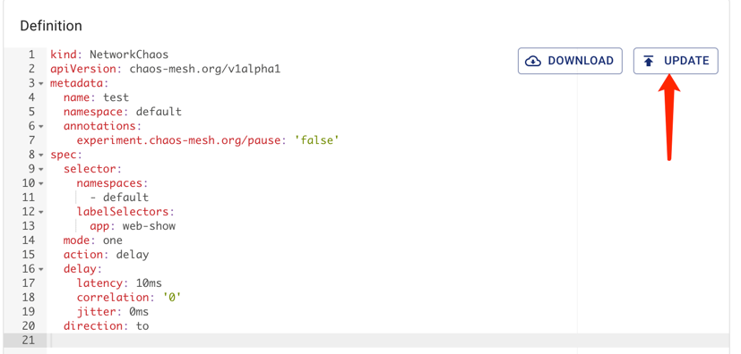

本文档主要介绍如何使用 Chaos Mesh 运行混沌实验、检查混沌实验结果以及清理混沌实验等。

## 创建混沌实验

Chaos Mesh 中混沌实验分为两类：独立混沌实验和带有时间调度规则混沌实验。从两类混沌实验的定义上可以得知，两类混沌实验主要区别在于是否需要定义时间调度规则。

### 独立混沌实验

独立的混沌实验是最小粒度混沌实验定义，也可以称为一次性混沌实验。当实验被创建后，会立刻对测试目标注入故障，只有当混沌实验被暂停或者删除时，故障才会被恢复。 当用户使用 YAML 管理混沌实验时，如创建网络混沌实验：

```yaml
apiVersion: chaos-mesh.org/v1alpha1
kind: NetworkChaos
metadata:
  name: network-delay
spec:
  action: delay # the specific chaos action to inject
  mode: one # the mode to run chaos action; supported modes are one/all/fixed/fixed-percent/random-max-percent
  selector: # pods where to inject chaos actions
    namespaces:
      - default
    labelSelectors:
      'app': 'web-show' # the label of the pod for chaos injection
  delay:
    latency: '10ms'
  duration: '12s'
```

上面 YAML 文件定义了一个持续 `12s` 的网络延迟故障，实验目标是 `default namespace` 下带有`"app": "web-show"` Label 的应用。详细的混沌实验定义请参考具体[模拟网络故障](simulate-network-chaos-on-kubernetes.md)。定义好混沌实验配置后，用户可以直接使用 `kubectl` 命令创建此混沌实验：

```yaml
kubectl apply -f network-delay.yaml
```

在创建混沌实验后，可以通过获取此混沌实验对象的 `status` 或者 `event` 检查混沌实验的运行情况：

```yaml
kubectl get events -n default
```

详细检查步骤参考文档[检查实验结果](inspect-chaos-experiment.md)

:::note
在 Dashboard 定义好混沌实验后，直接点击运行按钮即可，这里不在多加赘述
:::

### 带有时间调度规则混沌实验

Chaos Mesh 提供 `Schedule` 对象，帮助创建定时混沌实验和循环混沌实验。当用户使用 YAML 管理混沌实验时，如创建带有调度规则的网络混沌实验：

```yaml
apiVersion: chaos-mesh.org/v1alpha1
kind: Schedule
metadata:
  name: schedule-delay-example
spec:
  schedule: '5 * * * *'
  historyLimit: 2
  concurrencyPolicy: 'Allow'
  type: 'NetworkChaos'
  network_chaos:
    action: delay
    mode: one
    selector:
      namespaces:
        - default
      labelSelectors:
        'app': 'web-show'
    delay:
      latency: '10ms'
    duration: '12s'
```

带有调度规则的混沌实验和一次性混沌实验相比，主要增加了 `schedule` 参数，用来定义具体的调度规则，详细调度规则定义参考[定义调度规则](define-scheduling-rules.md)。定义好混沌实验配置后，用户同样直接使用 `kubectl` 命令创建此混沌实验。

## 暂停混沌实验

Chaos Mesh 对混沌实验提供了暂停操作，可以通过设置 Annotation 或是直接在 Dashboard 上点击暂停按钮来暂停混沌实验。例如在 `default` `namespace` 有一个 `network-delay` 的混沌实验对象，可以通过下面命令暂停混沌实验：

```yaml
kubectl annotate networkchaos network-delay experiment.chaos-mesh.org/pause=true
```

执行此命令后，注入的故障会被立刻恢复。如果想将此混沌实验从暂停状态中恢复到正常执行状态，可以通过如下命令：

```yaml
kubectl annotate networkchaos network-delay experiment.chaos-mesh.org/pause-
```

如果你想通过 Dashboard 暂停或者恢复混沌实验，找到对应的混沌实验点击 `PAUSE` 或者 `START` 按钮即可：


## 更新混沌实验

当混沌实验被创建后，用户可以通过编辑混沌实验对象配置来更新混沌实验。**对于已经正常运行的一次性混沌实验，目前还不支持更新故障配置操作，但可以更新当前的故障行为的持续时间（`duration` 参数），对于带有调度规则的混沌实验，会在当前正在执行的故障注入行为结束后生效**。

如果用户是使用 YAML 文件方式管理混沌实验，可以使用下列命令更新混沌实验：

```yaml
vim network-delay.yaml # modify network-delay.yaml to what you want
kubectl apply -f network-delay.yaml
```

如果只需要更新某个特定字段，也可以直接通过 `kubectl patch` 命令更新：

```yaml
kubectl path networchaos network-delay -p '{"spec":{"duration":"30s"}}'
```

更多通过 `kubectl` 命令来更新对象的操作，参考 [kubectl 文档](https://kubernetes.io/docs/reference/kubectl/cheatsheet/)。

如果你想要再 Dashboard 更新混沌实验，可以点击对应的混沌实验的 `CONFIGURATION` 按钮，通过编辑对应的对象起到更新的作用。



## 清理混沌实验

当用户结束混沌实验后，可以通过 `kubectl delete` 命令将混沌实验删掉，删掉混沌实验后，注入的故障会杯立刻恢复：

```yaml
kubectl delete -f network-delay.yaml
## or delete the chaos object directly
kubectl delete networkchaos network-delay
```

如果删除操作被阻塞住了，这意味着有一些目标对象的故障行为无法恢复。你可以查看 Chaos Mesh 的日志，或者直接在 GitHub 创建一个 [issue](https://github.com/pingcap/chaos-mesh/issues) 。此外，你也可以通过以下命令强制删除混沌实验：

```yaml
kubectl annotate networkchaos web-show-network-delay chaos-mesh.chaos-mesh.org/cleanFinalizer=forced
```

如果你想要在 Dashboard 上混沌实验，可以点击对应的混沌实验的 `ARCHIVE` 按钮，来删除混沌实验并归档到历史记录汇总。


