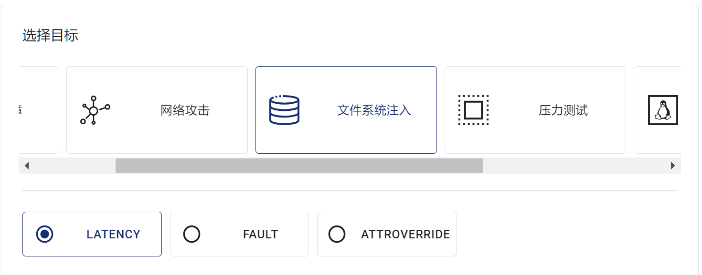
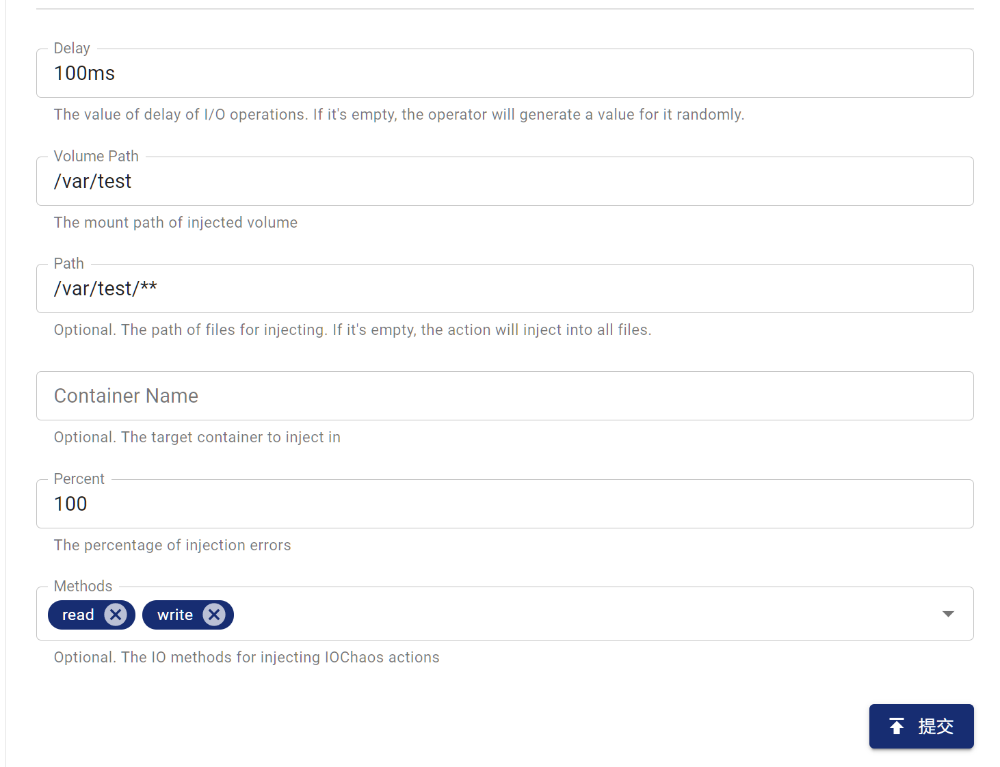
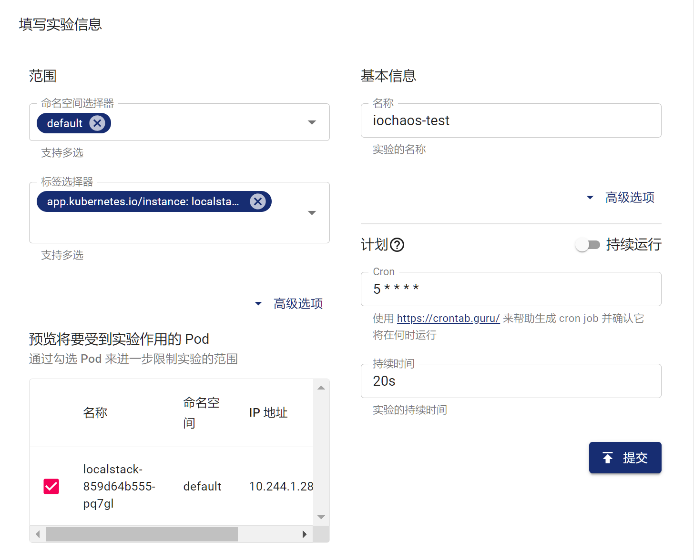

本文档主要介绍如何在 Chaos Mesh 中创建 IOChaos 混沌实验。
## IOChaos简介

IOChaos 能够帮助你模拟文件系统故障。目前支持以下类型的故障：

1. latency：为文件系统调用加入延迟

2. fault：使文件系统调用返回错误

3. attrOverride：修改文件属

4. mistake：使文件读到或写入错误的值

详细的功能介绍参见[使用 YAML 文件创建实验](#使用-yaml-文件创建实验)。

## 注意事项

1. 请确保目标 Pod 上没有运行 Chaos Mesh 的 Controller Manager。

2. IOChaos 可能会损坏你的数据，在生产环境中请**谨慎**使用。

## 使用 Dashboard 创建实验

1. 单击实验页面中的“新的实验”按钮进行创建实验。

   

2. 在“选择目标”处选择“文件系统注入”，并选择具体行为，如“LATENCY”

   

3. 填写实验信息，指定实验范围以及实验计划运行时间。

   

   

4. 提交实验。

   

## 使用 YAML 文件创建实验

如使用 YAML 方式创建实验，需要将实验配置写入到文件（如 `iochaos.yaml`）中。下文介绍各类型错误配置文件示例。

### latency 配置文件示例

```yaml
apiVersion: chaos-mesh.org/v1alpha1
kind: IOChaos
metadata:
  name: io-latency-example
  namespace: chaos-testing
spec:
  action: latency
  mode: one
  selector:
    labelSelectors:
      app: etcd
  volumePath: /var/run/etcd
  path: '/var/run/etcd/**/*'
  delay: '100ms'
  percent: 50
  duration: '400s'
```

该实验配置可以使得 `/var/run/etcd` 目录下的所有文件系统操作（包括读，写，列出目录内容等）产生 100 毫秒延迟。

### fault 配置文件示例

```yaml
apiVersion: chaos-mesh.org/v1alpha1
kind: IOChaos
metadata:
  name: io-fault-example
  namespace: chaos-testing
spec:
  action: fault
  mode: one
  selector:
    labelSelectors:
      app: etcd
  volumePath: /var/run/etcd
  path: /var/run/etcd/**/*
  errno: 5
  percent: 50
  duration: "400s"
```

该实验配置可以使得 `/var/run/etcd` 目录下的所有文件系统操作有 50% 的概率发生错误，并返回错误码 5 (Input/output error)。

### attrOverride 配置文件示例

```yaml
apiVersion: chaos-mesh.org/v1alpha1
kind: IOChaos
metadata:
  name: io-attr-example
  namespace: chaos-testing
spec:
  action: attrOverride
  mode: one
  selector:
    labelSelectors:
      app: etcd
  volumePath: /var/run/etcd
  path: /var/run/etcd/**/*
  attr:
    perm: 72
  percent: 10
  duration: "400s"
```

该实验配置可以使得 `/var/run/etcd` 目录下的所有文件系统操作将有 10% 的概率使目标文件的权限变为 72（即八进制下的 110），这将使得文件只能由拥有者与其所在的组执行，无权进行其他操作。

### mistake 配置文件示例

```yaml
apiVersion: chaos-mesh.org/v1alpha1
kind: IOChaos
metadata:
  name: io-mistake-example
  namespace: chaos-testing
spec:
  action: mistake
  mode: one
  selector:
    labelSelectors:
      app: etcd
  volumePath: /var/run/etcd
  path: /var/run/etcd/**/*
  mistake:
    filling: zero
    maxOccurrences: 1
    maxLength: 10
  methods:
    - READ
    - WRITE
  percent: 10
  duration: "400s"
```

该实验配置可以使得 `/var/run/etcd` 目录下的读写操作将有 10% 的概率将发生错误。其中以字节为单位，最大长度为 10 的 1 处随机位置将被替换为 0。

最后，使用 kubectl 创建实验，命令如下：

   ```bash
   kubectl apply -f iochaos.yaml
   ```

### 字段说明

#### 通用字段
|参数|类型|说明|默认值|是否必填|示例|
|---|---|---|---|---|---|
|action|string|表示具体的故障类型，仅支持 latency、fault、attrOverride、mistake||是|latency|
|mode|string|指定实验的运行方式，可选择的方式包括：`one`（表示随机选出一个符合条件的 Pod）、`all`（表示选出所有符合条件的 Pod）、`fixed`（表示选出指定数量且符合条件的 Pod）、`fixed-percent`（表示选出占符合条件的 Pod 中指定百分比的 Pod）、`random-max-percent`（表示选出占符合条件的 Pod 中不超过指定百分比的 Pod）|无|是|one|
|selector|struct|指定注入故障的目标 Pod，详情请参考[定义实验范围](./define-chaos-experiment-scope.md)|无|是||
|value|string|取决与 `mode` 的配置，为 `mode` 提供对应的参数。例如，当你将 `mode` 配置为 `fixed-percent` 时，`value` 用于指定 Pod 的百分比||否|2|
|volumePath|string|volume 在目标容器内的挂载点，必须为挂载的根目录||是|/var/run/etcd|
|path|string|注入错误的生效范围，可以是通配符，也可以是单个文件|默认对所有文件生效|否|/var/run/etcd/**/*|
|methods|string[]|需要注入故障的文件系统调用类型，具体支持的类型见[附录 A](#附录-a:methods-类型)|所有类型|否|READ|
|percent|int|每次操作发生故障的概率，单位为%|100|否|100|
|containerName|string|指定注入的容器名||否||
|duration|string|指定具体实验的持续时间||是|30s|

#### 与 action 相关的字段

这些字段仅在action为对应值时才有意义

- latency

  |参数|类型|说明|默认值|是否必填|示例|
  |---|---|---|---|---|---|
  |delay|string|具体的延迟时长||是|100 ms|

- fault
  |参数|类型|说明|默认值|是否必填|示例|
  |---|---|---|---|---|---|
  |errno|int|返回的错误号||是|22|

  常见的错误号见[附录 B](#附录-b：常见错误号)

- attrOverride
  |参数|类型|说明|默认值|是否必填|示例|
  |---|---|---|---|---|---|
  |attr|AttrOverrideSpec|具体的属性覆写规则||是|见下|

  AttrOverrideSpec 定义如下
  |参数|类型|说明|默认值|是否必填|示例|
  |---|---|---|---|---|---|
  |ino|int|inode 号||否||
  |size|int|文件大小||否||
  |blocks|int|文件占用块数||否||
  |atime|TimeSpec|最后访问时间||否||
  |mtime|TimeSpec|最后修改时间||否||
  |ctime|TimeSpec|最后状态变更时间||否||
  |kind|string|文件类型，详见 [fuser::FileType](https://docs.rs/fuser/0.7.0/fuser/enum.FileType.html)||否||
  |perm|int|文件权限的十进制表示||否|72（八进制下为 110）|
  |nlink|int|硬链接数量||否||
  |uid|int|所有者的用户 ID||否||
  |gid|int|所有者的组 ID||否||
  |rdev|int|设备 ID||否||

  TimeSpec 定义如下
  |参数|类型|说明|默认值|是否必填|示例|
  |---|---|---|---|---|---|
  |sec|int|以秒为单位的时间戳||否||
  |nsec|int|以纳秒为单位的时间戳||否||

  关于参数的具体含义，你可以参考 [man stat](https://man7.org/linux/man-pages/man2/lstat.2.html) 。

- mistake
  |参数|类型|说明|默认值|是否必填|示例|
  |---|---|---|---|---|---|
  |mistake|MistakeSpec|具体错误规则||是||

  MistakeSpec 定义如下
  |参数|类型|说明|默认值|是否必填|示例|
  |---|---|---|---|---|---|
  |filling|string|错误数据的填充内容，只能为 zero（填充0）或 random（填充随机字节）||是||
  |maxOccurrences|int|错误在每一次操作中最多出现次数||是|1|
  |maxLength|int|每次错误的最大长度（单位为字节）||是|1|

:: warn
  不推荐在除了 READ 和 WRITE 之外的文件系统调用上使用 mistake。这可能会导致预期之外的结果，包括但不限于文件系统损坏、程序崩溃等。
::


## 本地调试

如果你不确定某个 Chaos 的效果，也可以使用 [toda](https://github.com/chaos-mesh/toda) 在本地测试相应功能。Chaos Mesh 同样使用 toda 实现 IOChaos。

## 附录 A：methods 类型
- lookup
- forget
- getattr
- setattr
- readlink
- mknod
- mkdir
- unlink
- rmdir
- symlink
- rename
- link
- open
- read
- write
- flush
- release
- fsync
- opendir
- readdir
- releasedir
- fsyncdir
- statfs
- setxattr
- getxattr
- listxattr
- removexattr
- access
- create
- getlk
- setlk
- bmap

详见 [fuser::Filesystem](https://docs.rs/fuser/0.7.0/fuser/trait.Filesystem.html)

## 附录 B：常见错误号
- 1: Operation not permitted
- 2: No such file or directory
- 5: I/O error
- 6: No such device or address
- 12: Out of memory
- 16: Device or resource busy
- 17: File exists
- 20: Not a directory
- 22: Invalid argument
- 24: Too many open files
- 28: No space left on device

详见 [linux源码](https://raw.githubusercontent.com/torvalds/linux/master/include/uapi/asm-generic/errno-base.h)
