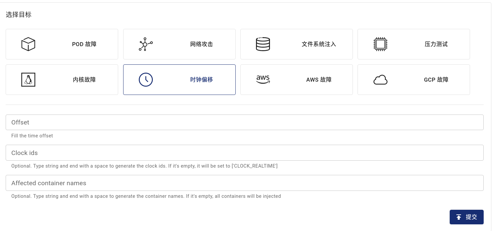
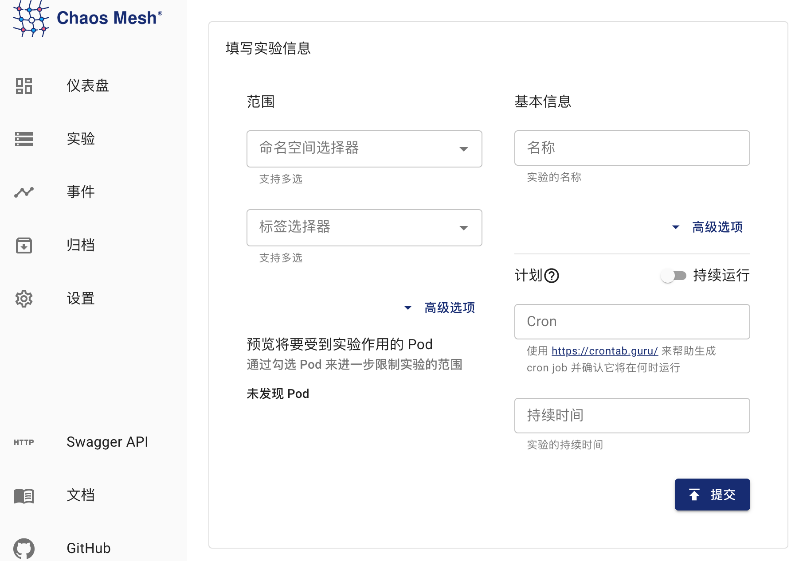

## TimeChaos 介绍

TimeChaos 能够帮助你模拟时间偏移的场景。

## 使用 Dashboard 方式创建实验

1. 单击实验页面中的新的实验按钮进行创建实验:

   

2. 在“选择目标”处选择 “时钟偏移”，然后填写选定的时钟和偏移量

   

3. 填写实验信息，指定实验范围以及实验计划运行时间：

   

4. 提交实验。

## 使用 YAML 方式创建实验

1. 将实验配置写入到文件中 `time-shift.yaml`，内容如下所示：

```yaml
apiVersion: chaos-mesh.org/v1alpha1
kind: TimeChaos
metadata:
  name: time-shift-example
  namespace: chaos-testing
spec:
  mode: one
  selector:
    labelSelectors:
      'app': 'app1'
  timeOffset: '-10m100ns'
```

该实验配置会使选中 Pod 中进程的时间向前偏移 10 分钟 100 纳秒

2. 使用 `kubectl` 创建实验，命令如下：

```bash
kubectl apply -f time-shift.yaml
```

### 字段说明

| 参数       | 类型     | 说明                                                                                                            | 默认值             | 是否必填 | 示例                                 |
| ---------- | -------- | --------------------------------------------------------------------------------------------------------------- | ------------------ | -------- | ------------------------------------ |
| timeOffset | string   | 指定时间偏移的长度                                                                                              | 无                 | 是       | -5m                                  |
| clockIds   | []string | 指定时间偏移作用的时钟，详见 [`clock_gettime` 文档](https://man7.org/linux/man-pages/man2/clock_gettime.2.html) | ["CLOCK_REALTIME"] | 否       | ["CLOCK_REALTIME","CLOCK_MONOTONIC"] |
