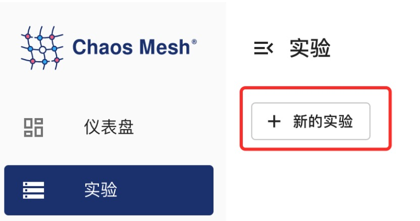

## TimeChaos 介绍

TimeChaos 能够帮助你模拟时间偏移的场景。

## 使用 Dashboard 方式创建实验

1. 单击实验页面中的新的实验按钮进行创建实验:

   

<!-- TODO -->

## 使用 YAML 方式创建实验

1. 将实验配置写入到文件中 `time-shift.yaml`，内容如下所示：

```yaml
apiVersion: chaos-mesh.org/v1alpha1
kind: TimeChaos
metadata:
  name: time-shift-example
  namespace: chaos-testing
spec:
  mode: one
  selector:
    labelSelectors:
      'app': 'app1'
  timeOffset: '-10m100ns'
```

该实验配置会使选中 Pod 中进程的时间向前偏移 10 分钟 100 纳秒

2. 使用 `kubectl` 创建实验，命令如下：

```bash
kubectl apply -f time-shift.yaml
```

### 字段说明

| 参数           | 类型     | 说明                                                                                | 默认值 | 是否必填 | 示例             |
| -------------- | -------- | ----------------------------------------------------------------------------------- | ------ | -------- | ---------------- |
| mode           | string   | 表示运行实验时候的运行方式，支持 one、all、fixed、fixed-percent、random-max-percent | 无     | 是       | one              |
| value          | string   | 取决与 mode 的取值，为 mode 提供参数                                                | 无     | 否       | 2                |
| selector       | struct   | 指定注入故障的目标 pod，可以参考[文档](./define-chaos-experiment-scope.md)          | 无     | 是       |                  |
| duration       | string   | 指定具体实验的持续时间                                                              | 无     | 是       | 30s              |
| containerNames | []string | 指定注入故障的目标 container 名                                                     | 无     | 否       | prometheus,nginx |
| timeOffset     | string   | 指定时间偏移的长度                                                                  | 无     | 是       | -5m              |
