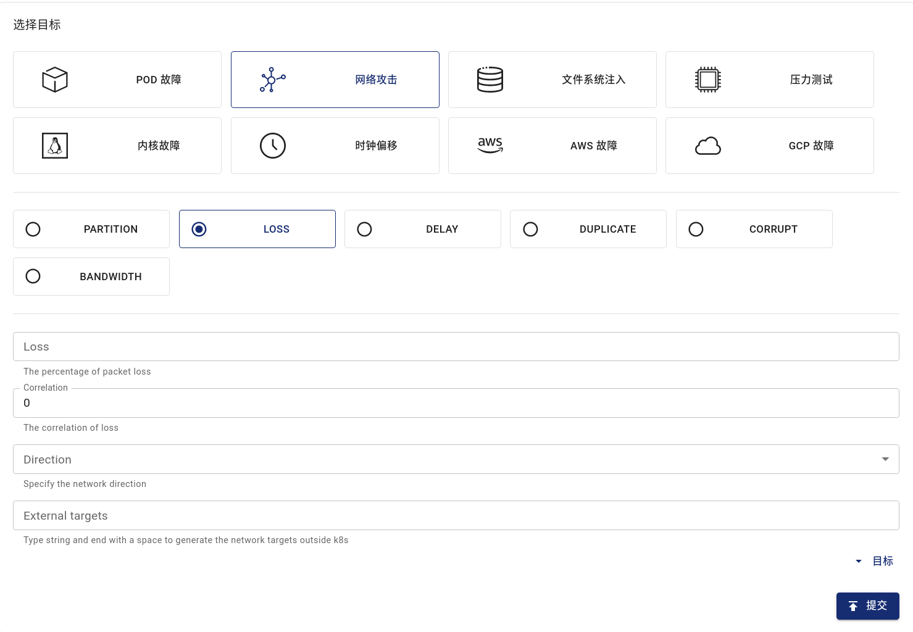

本文档介绍如何在 Chaos Mesh 中利用 NetworkChaos 模拟网络故障。

## NetworkChaos 介绍

NetworkChaos 是 Chaos Mesh 中的一种故障类型。通过创建 NetworkChaos 类型的混沌实验，你可以模拟集群发生网络故障的场景。目前 NetworkChaos 支持模拟以下故障类型：

- **Partition**：网络断开、分区。
- **Net Emulation**：网络状态不良，比如高延迟、高丢包率、包乱序等情况。
- **Bandwidth**：限制节点之间通信的带宽。

## 注意事项

创建 NetworkChaos 实验前，请确保以下事项：

1. 在注入网络故障的过程中，请保证 Controller Manager 与 Chaos Daemon 之间的连接通畅，否则故障将无法恢复。
2. 如果要模拟 Net Emulation 故障，请确保 Linux 内核拥有 NET_SCH_NETEM 模块。对于 CentOS，你可以通过 kernel-modules-extra 包安装 NET_SCH_NETEM 模块；对于大部分其他发行版，已默认安装相应模块。

## 使用 Dashboard 方式创建实验

1. 单击实验页面中的**新的实验**按钮创建实验。

   

2. 在**选择目标**处选择**网络攻击**，然后选择具体行为，例如 **LOSS**，最后填写具体配置。

   

   具体配置的填写方式，请参考[字段说明](#字段说明)。

3. 填写实验信息，指定实验范围以及实验计划运行时间。

   

4. 提交实验。

## 使用 YAML 方式创建实验

### Net Emulation 示例

1. 将实验配置写入 `network-delay.yaml` 文件，内容示例如下：

   ```yaml
   apiVersion: chaos-mesh.org/v1alpha1
   kind: NetworkChaos
   metadata:
     name: delay
   spec:
     action: delay
     mode: one
     selector:
       namespaces:
         - default
       labelSelectors:
         'app': 'web-show'
     delay:
       latency: '10ms'
       correlation: '100'
       jitter: '0ms'
   ```

该配置将使目标 Pod 的网络连接产生 10 毫秒的延迟。除了注入延迟以外，Chaos Mesh 还支持注入丢包、乱序等功能，详见[字段说明](#字段说明)。

2. 使用 `kubectl` 创建实验，命令如下：

   ```bash
   kubectl apply -f ./network-delay.yaml
   ```

### Partition 示例

1. 将实验配置写入 `network-partition.yaml` 文件，内容示例如下：

   ```yaml
   apiVersion: chaos-mesh.org/v1alpha1
   kind: NetworkChaos
   metadata:
     name: partition
   spec:
     action: partition
     mode: all
     selector:
       namespaces:
         - default
       labelSelectors:
         'app': 'app1'
     direction: to
     target:
       mode: all
       selector:
         namespaces:
           - default
         labelSelectors:
           'app': 'app2'
   ```

该配置将阻止从 `app1` 向 `app2` 建立的连接。`direction` 字段的值可以选择 `to`，`from` 及 `both`，详见[字段说明](#字段说明)。

2. 使用 `kubectl` 创建实验，命令如下：

   ```bash
   kubectl apply -f ./network-partition.yaml
   ```

### Bandwidth 示例

1. 将实验配置写入 `network-bandwidth.yaml` 文件，内容示例如下：

   ```yaml
   apiVersion: chaos-mesh.org/v1alpha1
   kind: NetworkChaos
   metadata:
     name: bandwidth
   spec:
     action: bandwidth
     mode: all
     selector:
       namespaces:
         - default
       labelSelectors:
         'app': 'app1'
     bandwidth:
       rate: '1mbps'
   ```

该配置将限制 `app1` 的带宽为 1 mbps。

2. 使用 `kubectl` 创建实验，命令如下：

   ```bash
   kubectl apply -f ./network-bandwidth.yaml
   ```

## 字段说明

### 通过字段说明

| 参数           | 类型     | 说明                                                                                                                                                                                                                                                                                                                                            | 默认值 | 是否必填 | 示例      |
| -------------- | -------- | ----------------------------------------------------------------------------------------------------------------------------------------------------------------------------------------------------------------------------------------------------------------------------------------------------------------------------------------------- | ------ | -------- | --------- |
| action         | string   | 指定具体的故障类型，可设置的类型包括：`netem`、`delay`（表示网络延迟故障）、`loss`（表示丢包故障）、`duplicate`（表示包重复故障）、`corrupt`（表示包错误故障）、`partition`（表示网络分区故障）、或`bandwidth`（表示带宽限制故障）。当指定了 `action` 字段后，请参考[与 `action` 相关的字段说明](#与-action-相关的字段说明)配置其他需要的字段。 | 无     | 是       | partition |
| target         | Selector | 与 direction 组合使用，使 Chaos 只对部分包生效                                                                                                                                                                                                                                                                                                  | 无     | 否       |           |
| direction      | enum     | 指定 `target` 包的方向，可设置的值包括 `from` (表示来自 `target` 的包）、`to`（表示发往 `target` 的包）、 或 `both`（表示 `target` 收到或者发出的包），使 Chaos 只对指定方向的包生效。                                                                                                                                                          | to     | 否       | both      |
| mode           | string   | 指定实验的运行方式，可选择的方式包括：`one`（表示随机选出一个符合条件的 Pod）、`all`（表示选出所有符合条件的 Pod）、`fixed`（表示选出指定数量且符合条件的 Pod）、`fixed-percent`（表示选出占符合条件的 Pod 中指定百分比的 Pod）、`random-max-percent`（表示选出占符合条件的 Pod 中不超过指定百分比的 Pod）                                      | 无     | 是       | `one`     |
| value          | string   | 取决与 `mode` 的配置，为 `mode` 提供对应的参数。例如，当你将 `mode` 配置为 `fixed-percent` 时，`value` 用于指定 Pod 的百分比                                                                                                                                                                                                                    | 无     | 否       | 2         |
| containerNames | []string | 指定注入的容器名称                                                                                                                                                                                                                                                                                                                              | 无     | 否       | ["nginx"] |
| selector       | struct   | 指定注入故障的目标 Pod，详情请参考[定义实验范围](./define-chaos-experiment-scope.md)                                                                                                                                                                                                                                                            | 无     | 是       |           |

### 与 `action` 相关的字段说明

对于 Net Emulation 类型和 Bandwidth 类型的 `action`，你还可以按照本小节的字段说明进一步设置相关参数。

- Net Emulation 类型：`delay`、`loss`、`duplicate`、`corrupt`
- Bandwidth 类型：`bandwidth`

#### delay

如果将 `action` 设置为 `delay`，表示模拟网络延迟故障。此时，你还可以设置以下相关参数。

| 参数        | 类型              | 说明                                           | 默认值 | 是否必填 | 示例 |
| ----------- | ----------------- | ---------------------------------------------- | ------ | -------- | ---- |
| latency     | string            | 表示延迟的时间长度                             | 0      | 否       | 2ms  |
| correlation | string            | 表示延迟时间的时间长度与前一次延迟时长的相关性 | 0      | 否       | 0.5  |
| jitter      | string            | 表示延迟时间的变化范围                         | 0      | 否       | 1ms  |
| reorder     | Reorder(#Reorder) | 表示网络包乱序的状态                           |        | 否       |      |

其中，`correlation` 参数的计算模型如下：

1. 首先生成一个分布与上一个值有关的随机数：

   ```c
   rnd = value * (1-corr) + last_rnd * corr
   ```

其中 `rnd` 为这一随机数。`corr` 为填写的 `correlation`。

2. 使用这一随机数决定当前包的延迟：

   ```c
   ((rnd % (2 * sigma)) + mu) - sigma
   ```

   其中 `sigma` 为 `jitter`，`mu` 为 `latency`。

#### reorder

如果将 `action` 设置为 `reorder`，表示模拟网络包乱序的故障。此时，你还可以设置以下相关参数。

| 参数        | 类型   | 说明                                   | 默认值 | 是否必填 | 示例 |
| ----------- | ------ | -------------------------------------- | ------ | -------- | ---- |
| reorder     | string | 表示发生重新排序的概率                 | 0      | 否       | 0.5  |
| correlation | string | 表示发生重新排序的概率与前一次的相关性 | 0      | 否       | 0.5  |
| gap         | int    | 表示乱序将包推后的距离                 | 0      | 否       | 5    |

#### loss

如果将 `action` 设置为 `loss`，表示模拟丢包故障。此时，你还可以设置以下相关参数。

| 参数        | 类型   | 说明                                       | 默认值 | 是否必填 | 示例 |
| ----------- | ------ | ------------------------------------------ | ------ | -------- | ---- |
| loss        | string | 表示丢包发生的概率                         | 0      | 否       | 0.5  |
| correlation | string | 表示丢包发生的概率与前一次是否发生的相关性 | 0      | 否       | 0.5  |

#### duplicate

如果将 `action` 设置为 `duplicate`，表示模拟包重复故障。此时，你还可以设置以下相关参数。

| 参数        | 类型   | 说明                                         | 默认值 | 是否必填 | 示例 |
| ----------- | ------ | -------------------------------------------- | ------ | -------- | ---- |
| duplicate   | string | 表示包重复发生的概率                         | 0      | 否       | 0.5  |
| correlation | string | 表示包重复发生的概率与前一次是否发生的相关性 | 0      | 否       | 0.5  |

#### corrupt

如果将 `action` 设置为 `corrupt`，表示模拟包错误的情况。此时，你还可以设置以下相关参数。

| 参数        | 类型   | 说明                                         | 默认值 | 是否必填 | 示例 |
| ----------- | ------ | -------------------------------------------- | ------ | -------- | ---- |
| corrupt     | string | 表示包错误发生的概率                         | 0      | 否       | 0.5  |
| correlation | string | 表示包错误发生的概率与前一次是否发生的相关性 | 0      | 否       | 0.5  |

对于 `reorder`、`loss`、`duplicate`、`corrupt` 这些偶发事件，`correlation` 则更为复杂。具体模型描述参考 [NetemCLG](http://web.archive.org/web/20200120162102/http://netgroup.uniroma2.it/twiki/bin/view.cgi/Main/NetemCLG) 。

#### bandwidth

如果将 `action` 设置为 `bandwidth`，表示模拟带宽限制的故障。此时，你还需要设置以下相关参数。

| 参数     | 类型   | 说明                                              | 默认值 | 是否必填 | 示例  |
| -------- | ------ | ------------------------------------------------- | ------ | -------- | ----- |
| rate     | string | 表示带宽限制的速率                                |        | 是       | 1mbps |
| limit    | uint32 | 表示在队列中等待的字节数                          |        | 是       | 1     |
| buffer   | uint32 | 能够瞬间发送的最大字节数                          |        | 是       | 1     |
| peakrate | uint64 | `bucket` 的最大消耗率 （通常情况下不需要设置）    |        | 否       | 1     |
| minburst | uint32 | `peakrate bucket` 的大小 （通常情况下不需要设置） |        | 否       | 1     |

如果需要进一步了解这些字段的含义，请参阅 [tc-tbf 文档](https://man7.org/linux/man-pages/man8/tc-tbf.8.html)。
