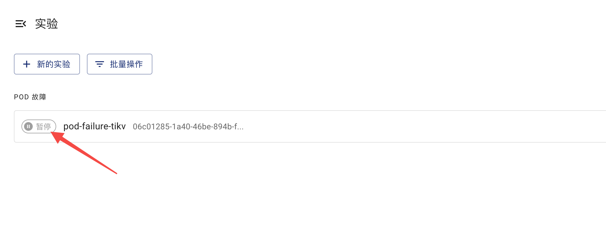
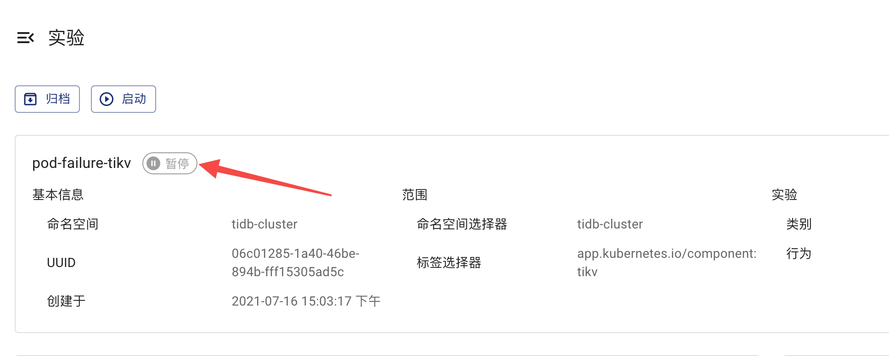

本文档介绍如何使用 Chaos Mesh 检查混沌实验的运行状态和结果。

## 实验阶段介绍

在 Chaos Mesh 中，根据实验的执行流程，一个混沌实验的生命周期主要分为以下四个阶段：

- 注入阶段：混沌实验正在进行注入故障操作。通常情况下，此阶段持续的时间很短。如果此阶段持续的时间很长，可能是由于混沌实验出现了异常，此时可以查看事件信息确定异常原因。
- 运行阶段：当所有测试目标都已经被成功注入故障后，混沌实验进入运行阶段。
- 暂停阶段：当对混沌实验进行[暂停](run-a-chaos-experiment.md/#暂停混沌实验)操作时，Chaos Mesh 会恢复所有测试目标，此时实验进入暂停阶段。
- 结束阶段：如果配置了实验持续时间，当实验运行时间达到了持续时间后，Chaos Mesh 会恢复所有测试目标，表示实验已经结束。

## 通过 Chaos Dashboard 检查实验结果

在 Chaos Dashboard 中，你可以在以下任一页面查看实验的运行阶段：

- 混沌实验列表页面：

  

- 混沌实验详情页面：

  

:::note 注意

- 如果一个混沌实验长时间处于**注入**阶段，可能是由于此实验出现了异常（例如，配置的 Selectors 未选出待测目标）。此时，你可以通过查看**事件信息**确定异常原因，并检查混沌实验的配置信息。
- Chaos Dashboard 中仅展示了[主要实验阶段](#实验的阶段介绍)，如需查看更详细的实验状态，请通过 `kubectl` 检查实验结果。

:::

## 通过 `kubectl` 检查实验结果

可以使用 `kubectl describe` 命令查看此混沌实验对象的 `Status` 和 `Events`，从而确定实验结果。

```shell
kubectl describe podchaos pod-failure-tikv -n tidb-cluster
```

执行上述命令后，预期输出如下：

```shell
...
Status:
  Conditions:
    Reason:
    Status:  False
    Type:    Paused
    Reason:
    Status:  True
    Type:    Selected
    Reason:
    Status:  True
    Type:    AllInjected
    Reason:
    Status:  False
    Type:    AllRecovered
  Experiment:
    Container Records:
      Id:            tidb-cluster/basic-tikv-0
      Phase:         Injected
      Selector Key:  .
    Desired Phase:   Run
Events:
  Type    Reason           Age   From          Message
  ----    ------           ----  ----          -------
  Normal  FinalizerInited  39s   finalizer     Finalizer has been inited
  Normal  Paused           39s   desiredphase  Experiment has been paused
  Normal  Updated          39s   finalizer     Successfully update finalizer of resource
  Normal  Updated          39s   records       Successfully update records of resource
  Normal  Updated          39s   desiredphase  Successfully update desiredPhase of resource
  Normal  Started          17s   desiredphase  Experiment has started
  Normal  Updated          17s   desiredphase  Successfully update desiredPhase of resource
  Normal  Applied          17s   records       Successfully apply chaos for tidb-cluster/basic-tikv-0
  Normal  Updated          17s   records       Successfully update records of resource
```

上述输出中，主要包含两部分：

- `Status`

  依据混沌实验的执行流程，`Status` 提供了以下四类状态记录：

  - `Paused`： 代表混沌实验正处于暂停阶段。
  - `Selected`： 代表混沌实验已经正确选择出待测试目标。
  - `AllInjected`：代表所有测试目标都已经被成功注入故障。
  - `AllRecoverd`：代表所有测试目标的故障都已经被成功恢复。

  可以通过这四类状态记录推断出当前混沌实验的真实运行情况。例如：

  - 当 `Paused`、`Selected`、`AllRecoverd` 的状态是 `True` 且 `AllInjected` 的状态是 `False`时，说明当前实验处在暂停状态。
  - 当 `Paused` 为 `True` 的时，说明当前实验处在暂停状态，但是如果此时的 `Selected` 值为 `False`，那么可以进一步得出此混沌实验无法选出待测试目标。

  :::note 注意

  你可以从上述的四类实验记录组合中可以推导出更多的信息，例如当 `Paused` 为 `True` 的时候，说明混沌实验处在暂停状态，但是如果此时的 `Selected` 值为 `False`，那么可以进一步得出此混沌实验无法选出待测试目标。

  :::

- `Events`

  事件列表中包含混沌实验整个生命周期中的操作记录，可以帮助确定混沌实验状态并排除问题。
